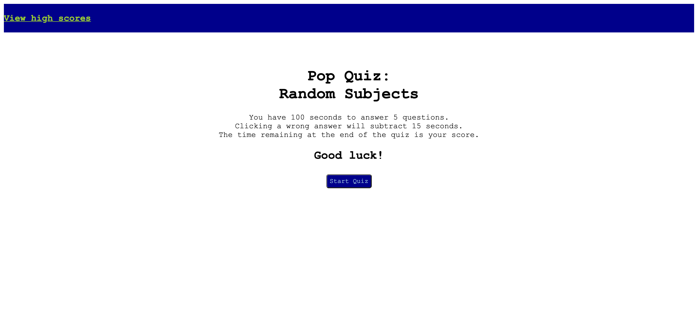
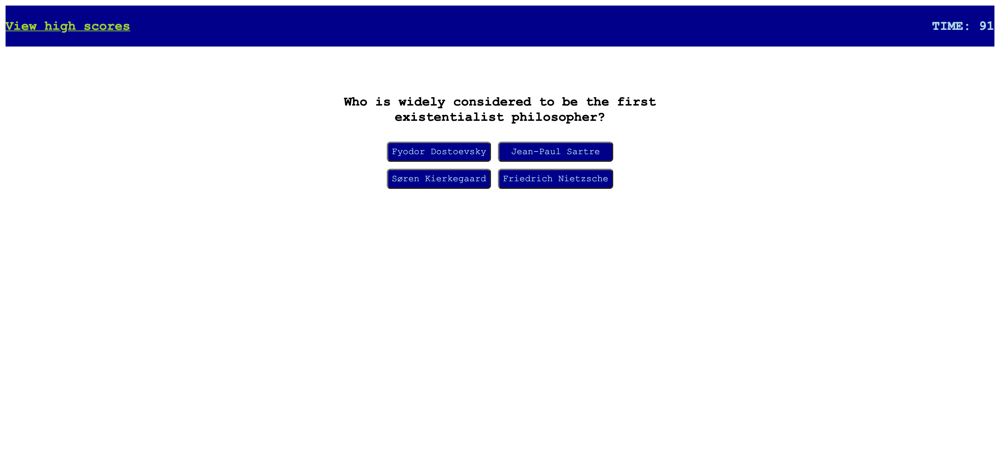

# quick-lil-quizzy
A short quiz covering the first few topics that came to mind.

## Project Description
-The goal of this project was to demonstrate what I've learned about the building blocks of web design. It involved revisiting HTML and CSS, as well as applying less familiar concepts in JavaScript such as object literals and local storage. 
-I learned: 
<>How to bring multiple functions and event listeners together into a coehsive JavaScript file. 
<>How to write object literals. 
<>How to set/get data to/from local storage. 
-I reviewed: 
<>HTML structure. 
<>Flex boxes. 
<>if else statements. 

## Usage
-The "Start Screen" includes a short description and a "Start Quiz" button. 
-Clicking the "Start Quiz" button will initiate a 99-second countdown timer in the top-right corner, and present users with a series of questions and multiple-choice answers. 
-Each incorrect answer will subtract 15 points from the remaining time. 
-When all questions have been answered, or if the timer reaches zero, the remaining time will be recorded as the user's score and the user will be prompted to enter their name for a high score list. 
-Clicking the "Submit Score" button will take the user to the "High Scores" page, where they will see their name and score. 
-Clicking the "Go back" button will take the user back to the "Start Screen". 
-Successive attempts will allow the user to log a new name and/or score to the high scores list. (currently in progress) 
-Clicking the "Clear scores" button will clear the current high scores list. (currently in progress) 
https://sammn721.github.io/quick-lil-quizzy/ 

